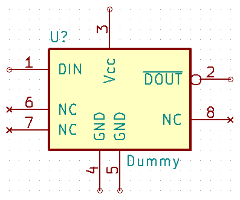
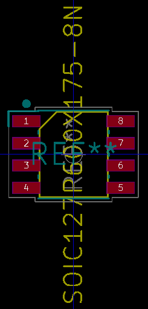

QEDA.js
=======

QEDA.js is a Node.js library aimed to simplify creating libraries of electronic components for using in EDA software. You can easily create both symbols for schematic and land patterns for PCB.

Attention
=========

**The project is under active development. Not recommended for use in production.**

Features
========

* Downloading component definitions from global repository
* Generating schematic symbols:
  - Single and multi part IC (dual-in-line, quad)
* Borrowing packages dimensions from standards:
  - JEDEC (partially)
* Land pattern calculation according to IPC-7351:
  - QFN
  - QFP
  - SOP (and SOIC)
* Generating libraries:
  - KiCad format

Installation
============

QEDA.js module for using in scripts:

    npm install qeda


Examples
========

Examples below is written on CoffeeScript but one can use vanilla JavaScript.

Generating KiCad library from script
------------------------------------

[script.coffee](./examples/script/script.coffee):

```coffeescript
Qeda = require 'qeda'

lib = new Qeda.Library
lib.add 'Altera/5M1270ZT144' # Adding Altera MAX V CPLD
lib.add 'ST/L3GD20H' # Adding STMicroelectronics gyroscope
lib.add 'TI/ISO721' # Adding Texas Instruments digital isolator
lib.add 'TI/ISO722' # Adding Texas Instruments digital isolator
lib.generate 'mylib'
```

This example will download component descriptions from [library repository](https://github.com/qeda/library/) then save them to disk and add to library manager. Last string is to generate component library in KiCad format (schematic symbols for [Eeschema](http://kicad-pcb.org/discover/eeschema/) as well as PCB footprints for [PcbNew](http://kicad-pcb.org/discover/pcbnew/)).

Run it:

    coffee script.coffee

And find generated files in `./kicad` directory.

_API will be documented soon._

Custom component description
----------------------------

Any electronic component is described using YAML-file located in `./library` directory (or some subdirectory within). You can clone all available descriptions from <https://github.com/qeda/library>, add your ones, copy from any source. Then just point correspondent path as parameter for `Qeda.Library.add` method (without `./library/` prefix and `.yaml` suffix).

[library/dummy.yaml](./examples/custom/library/dummy.yaml):

```yaml
name: Dummy

pinout:
  DIN: 1
  ~DOUT: 2
  Vcc: 3
  GND: 4, 5
  NC: 6-8

properties:
  power: Vcc
  ground: GND
  in: DIN
  out: ~DOUT
  nc: NC
  inverted: ~DOUT

schematic:
  symbol: IC
  left: DIN, NC
  right: ~DOUT, NC
  top: Vcc
  bottom: GND

housing:
  pattern: SOIC
  outline: JEDEC MS-012 AA
```

_Available YAML fields will be documented soon._

[custom.coffee](./examples/custom/custom.coffee):

```coffeescript
Qeda = require 'qeda'

lib = new Qeda.Library
lib.add 'Dummy' # Adding custom element
lib.generate 'dummy'
```

Run it:

    coffee custom.coffee

Result:




License
=======

Source code is licensed under [MIT license](./LICENSE.md).

Coming soon
===========

* Generating schematic symbols:
  - Resistors
  - Capacitors
  - Special symbols (ground, power supply, test points etc.)
  - GOST
* Generating libraries:
  - Eagle XML format
* SMD land pattern calculation:
  - BGA
  - CFP
  - CGA
  - CQFP
  - Chip
  - Chip array
  - Crystal
  - DFN
  - LGA
  - LCC
  - MELF
  - Molded body
  - Oscillator
  - PLCC
  - SOD
  - SODFL
  - SOJ
  - SON
  - SOTFL
  - SOT23
  - SOT143
  - SOT223
  - TO
* Through-hole land pattern calculation:
  - Axial lead
  - DIP
  - DIL Socket
  - Mounting holes
  - Oscillator
  - PGA
  - Radial lead
  - SIP
  - Test point
  - TO (Flange mount)
  - TO (Cylindrical)
  - Wire
* 3D models generation
